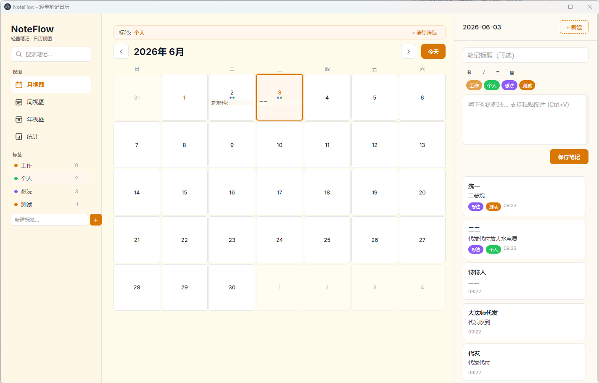
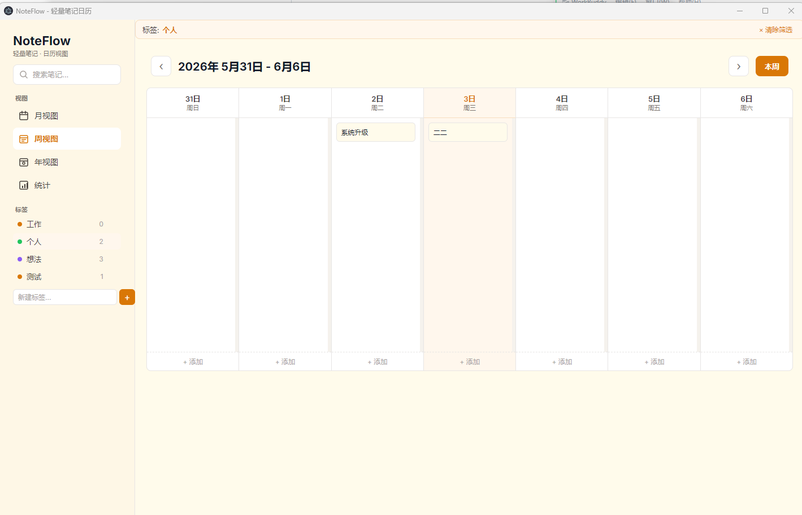
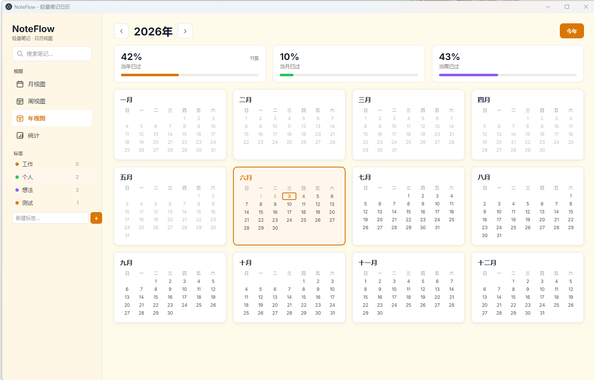
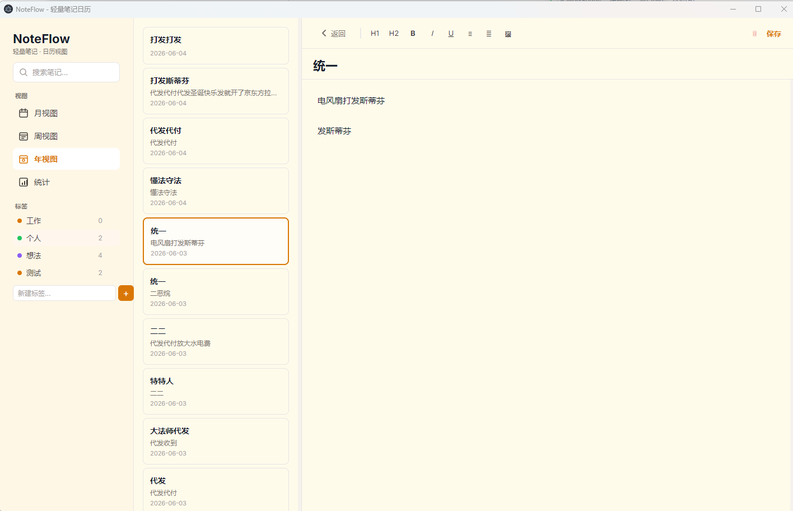
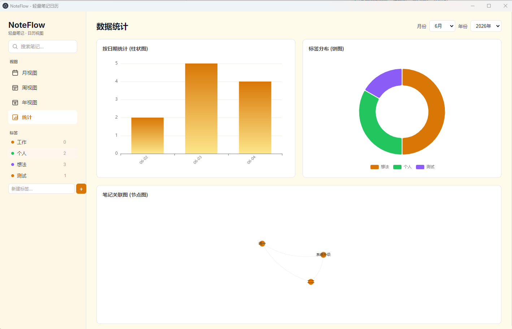

# NoteFlow

轻量笔记日历应用 — 以日历为核心的个人笔记管理工具。

## 功能

- **五视图切换**：月视图 / 周视图 / 年视图 / 编辑视图 / 数据统计
- **富文本编辑**：加粗、斜体、下划线、标题、列表、引用、图片缩放
- **图片粘贴**：Ctrl+V 粘贴剪贴板图片，拖拽调整大小，按月份分目录存储
- **标签系统**：动态增删标签，侧边栏一键过滤，8 色自动配色
- **搜索过滤**：实时搜索标题+正文，支持与标签交叉过滤，搜索条件保持
- **数据统计**：柱状图（按日期，可按月筛选）、环形饼图（标签分布）、力导图（笔记关联网络）
- **自动保存**：停止输入 3 秒后自动保存，右下角隐蔽提示
- **多皮肤切换**：暖黄 / 暗夜 / 薄荷 / 薰衣草 / 极简白
- **时间进度**：年视图显示当年/当月/当周已过百分比

## 截图

### 月视图


### 周视图


### 年视图


### 编辑视图


### 数据统计


## 技术栈

| 层 | 技术 |
|---|------|
| 框架 | Electron 31 |
| 前端 | 原生 HTML / CSS / JavaScript |
| 存储 | JSON 文件 (`data/noteflow-data.json`) |
| 图表 | ECharts 5.5 |
| 字体 | Inter |

## 快速开始

```bash
git clone git@github.com:therealcassini/noteflow.git
cd noteflow
npm install
set ELECTRON_MIRROR=https://npmmirror.com/mirrors/electron/
npm start
```

## 项目结构

```
noteflow/
├── main.js          # Electron 主进程（窗口、IPC、数据存储）
├── preload.js       # 安全 IPC 桥接
├── start.js         # 启动脚本
├── index.html       # 全部视图
├── styles.css       # 样式表（含 5 套皮肤变量）
├── app.js           # 前端逻辑
├── data/            # 笔记数据（JSON，不入库）
├── upload/          # 图片按 YYYY_MM 分目录存储
├── image/           # 截图
└── package.json
```

## 快捷键

| 快捷键 | 功能 |
|--------|------|
| Ctrl+S | 保存笔记 |
| Ctrl+N | 新建笔记 |
| Ctrl+V | 粘贴图片 |

## 数据存储

数据存放在 `data/noteflow-data.json`，图片按月份存入 `upload/YYYY_MM/`，完全本地化，无需网络。
